# Catalyst Lab Architecture

This document describes the architecture of the Catalyst Lab Kubernetes infrastructure for LLM deployment, benchmarking, and observability.

## System Architecture

```mermaid
graph LR
    %% Users
    User(["👤 User"])
    Admin(["👨‍💼 Administrator"])

    %% Frontend Layer
    subgraph Frontend["🎨 Frontend Layer"]
        WebUI["WebUI<br/>Llama-Stack Client"]
    end

    %% Orchestration Layer
    subgraph Orchestration["🤖 Orchestration & Agents"]
        direction TB
        Kagenti["Kagenti<br/>K8s Agent Orchestrator"]
        BeeAI["BeeAI Agent<br/>Kagenti CRD<br/>A2A Port: 9999"]
        AgenticBench["Agentic Benchmark<br/>TravelPlanner<br/>VendingBench"]
    end

    %% LLM Inference Layer
    subgraph LLMInference["🚀 LLM Inference Stack"]
        direction TB
        LlamaStack["LLAMA-STACK Server<br/>Main Orchestrator"]
        KServe["KServe<br/>Model Serving Platform"]
        LlmdScheduler["llm-d Scheduler<br/>Workload Manager"]
        LlmdVLLM["llm-d vLLM<br/>Inference Engine"]
    end

    %% MCP Integration Layer
    subgraph MCPServers["🔌 MCP Integration Layer"]
        direction TB
        KuadrantMCP["Kuadrant Gateway<br/>MCP Router"]
        GitHubMCP["GitHub MCP<br/>Source Control"]
        JiraMCP["Jira MCP<br/>Project Mgmt"]
        SearchMCP["Search MCP<br/>Web Search"]
        BenchmarkMCP["Benchmark MCP<br/>Performance"]
    end

    %% Storage Layer
    subgraph Storage["💾 Data Storage Layer"]
        direction TB
        PgVector["PgVector<br/>Vector Embeddings<br/>HNSW Index"]
        Posgresql["PostgreSQL 17<br/>Primary Database<br/>CloudNativePG"]
    end

    %% Observability Layer
    subgraph Observability["📊 Observability & Monitoring"]
        direction TB
        MLFlow["MLFlow<br/>LLM Trace Collection<br/>Experiment Tracking"]
        VisualMLFlow["Visual MLFlow<br/>TBD - Visualization"]
        GrafanaDash["Grafana<br/>Monitoring Dashboards"]
        OtelPrometheus["OpenTelemetry<br/>+ Prometheus<br/>Metrics Collection"]
    end

    %% External Services
    subgraph External["🌐 External Services"]
        direction TB
        Github["GitHub API"]
        Jira["Jira API"]
        BraveSearch["Brave Search API"]
    end

    %% User Interactions
    User -->|"Web Interface"| WebUI
    User -->|"Run Benchmarks"| AgenticBench
    Admin -->|"Monitor"| GrafanaDash

    %% Frontend to Core
    WebUI <-->|"API Calls"| LlamaStack

    %% Orchestration Flow
    AgenticBench -->|"Trigger Tasks"| Kagenti
    Kagenti -->|"Deploy Agents"| BeeAI
    Kagenti -->|"Send Traces"| VisualMLFlow
    BeeAI -->|"LLM Requests"| LlamaStack

    %% LLM Inference Flow
    LlamaStack -->|"Vector Search"| PgVector
    LlamaStack -->|"Store Data"| Posgresql
    LlamaStack -->|"Inference Requests"| KServe
    KServe -->|"Schedule"| LlmdScheduler
    KServe -->|"Execute"| LlmdVLLM
    LlmdScheduler -->|"Assign"| LlmdVLLM

    %% MCP Gateway Integration
    LlamaStack -->|"Tool Calls"| KuadrantMCP
    KuadrantMCP <-->|"Route"| GitHubMCP
    KuadrantMCP <-->|"Route"| JiraMCP
    KuadrantMCP <-->|"Route"| SearchMCP
    KuadrantMCP <-->|"Route"| BenchmarkMCP

    %% External Connections
    GitHubMCP <-->|"REST API"| Github
    JiraMCP <-->|"REST API"| Jira
    SearchMCP <-->|"Search API"| BraveSearch

    %% Observability Flow
    VisualMLFlow -->|"Visualize"| MLFlow
    MLFlow -->|"Store Traces"| Posgresql
    MLFlow <-->|"Collect Traces"| LlamaStack
    OtelPrometheus -->|"Scrape Metrics"| LlamaStack
    OtelPrometheus -->|"Scrape Metrics"| KServe
    GrafanaDash -->|"Query"| OtelPrometheus
    Kagenti -->|"Send Metrics"| MLFlow

    %% Styling with better visibility
    classDef userStyle fill:#4A90E2,stroke:#2E5C8A,stroke-width:3px,color:#fff
    classDef frontendStyle fill:#E8F4F8,stroke:#4A90E2,stroke-width:2px,color:#000
    classDef orchestrationStyle fill:#FFE066,stroke:#CC9900,stroke-width:3px,color:#000
    classDef inferenceStyle fill:#90EE90,stroke:#2D7A2D,stroke-width:3px,color:#000
    classDef storageStyle fill:#E8E8E8,stroke:#666,stroke-width:2px,color:#000
    classDef mcpStyle fill:#DDA0DD,stroke:#8B008B,stroke-width:2px,color:#000
    classDef observabilityStyle fill:#FF6B6B,stroke:#CC0000,stroke-width:3px,color:#fff
    classDef externalStyle fill:#F0F0F0,stroke:#999,stroke-width:2px,color:#000

    class User,Admin userStyle
    class WebUI frontendStyle
    class Kagenti,BeeAI,AgenticBench orchestrationStyle
    class KServe,LlmdScheduler,LlmdVLLM,LlamaStack inferenceStyle
    class PgVector,Posgresql storageStyle
    class KuadrantMCP,GitHubMCP,JiraMCP,SearchMCP,BenchmarkMCP mcpStyle
    class MLFlow,VisualMLFlow,GrafanaDash,OtelPrometheus observabilityStyle
    class Jira,Github,BraveSearch externalStyle
```

## Component Descriptions

### Frontend Layer

- **WebUI (Llama-Stack Client)**: User-facing interface for interacting with the LLM inference stack

### Orchestration & Agents

- **Kagenti**: Kubernetes-native agent orchestration system
- **BeeAI Agent**: AI agent implementation using Kagenti CRD, exposes Agent-to-Agent (A2A) interface on port 9999

### Storage Layer

- **PgVector**: PostgreSQL with pgvector extension for vector embeddings and similarity search
- **PostgreSQL**: Primary database for storing application data, traces, and metadata

### LLM Inference

- **LLAMA-STACK Server**: Core LLM inference orchestration server
- **KServe**: Kubernetes-native model serving platform for ML inference
- **llm-d Scheduler**: Custom scheduler for LLM workload management
- **llm-d vLLM**: vLLM engine for efficient LLM inference

### MCP Servers (Model Context Protocol)

- **Kuadrant MCP Gateway**: Central gateway for routing MCP requests
- **GitHub MCP Server**: Integration with GitHub APIs
- **Jira MCP Server**: Integration with Jira project management
- **Search MCP Server**: Web search integration (Brave Search)
- **Benchmark MCP Server**: Benchmarking service integration

### Observability & Monitoring

- **MLFlow**: LLM trace collection and experiment tracking
- **Visual For MLFlow**: Visualization layer for MLFlow data (TBD)
- **Grafana Dashboard**: Monitoring dashboards for administrators
- **OTel+Prometheus**: OpenTelemetry and Prometheus for metrics collection

### Benchmarking

- **Agentic Benchmark**: Benchmark suite including TravelPlanner and VendingBench for evaluating agentic AI systems

### External Services

- **GitHub**: Source code repository integration
- **Jira**: Project management and issue tracking
- **Brave Search**: Web search API for information retrieval

## Data Flow

### User Request Flow

1. User interacts with **WebUI**
2. WebUI sends requests to **LLAMA-STACK Server**
3. LLAMA-STACK routes inference requests to **KServe**
4. KServe uses **llm-d scheduler** to manage workload placement
5. Inference is executed by **llm-d vLLM** engine
6. Results are returned to the user via LLAMA-STACK and WebUI

### Agent Orchestration Flow

1. **Agentic Benchmark** triggers tasks via **Kagenti**
2. Kagenti orchestrates **BeeAI Agent** instances
3. BeeAI communicates with **LLAMA-STACK** for LLM capabilities
4. LLAMA-STACK accesses external services via **MCP Gateway**
5. MCP servers interact with external APIs (GitHub, Jira, Search)

### Observability Flow

1. **LLAMA-STACK** and **KServe** emit OpenTelemetry traces
2. **OTel+Prometheus** collects metrics and traces
3. **MLFlow** captures LLM-specific traces and logs
4. **Grafana Dashboard** visualizes metrics for administrators
5. **Visual For MLFlow** provides LLM trace visualization

## Deployment Considerations

### Resource Requirements

- **LLM Inference (vLLM)**: GPU-enabled nodes required
- **PostgreSQL/PgVector**: Persistent storage with high I/O performance
- **Observability Stack**: Moderate CPU/memory for metrics aggregation
- **MCP Servers**: Lightweight, can run on standard nodes

### Network Architecture

- Internal service-to-service communication within Kubernetes cluster
- External ingress for WebUI and administrative interfaces
- Secure connectivity to external APIs (GitHub, Jira, Brave Search)
- A2A communication on port 9999 for agent interactions

### Storage Strategy

- **PgVector**: Vector embeddings storage (20Gi default)
- **PostgreSQL**: Application data, traces, MLFlow experiments
- **Benchmark Results**: Persistent volume claims for GuideLLM outputs

## Security Considerations

- Network policies for service isolation
- Secret management for external API credentials
- RBAC for Kubernetes resource access
- TLS/HTTPS for external endpoints
- Authentication/authorization for MCP gateway

## Scalability

- **KServe**: Horizontal scaling for inference workloads
- **vLLM**: GPU resource pooling and efficient batching
- **PostgreSQL**: Read replicas for observability queries
- **MCP Servers**: Stateless, can scale horizontally
- **Kagenti**: Distributed agent orchestration

## Future Enhancements

- Enhanced MLFlow visualization (Visual For MLFlow)
- Additional MCP server integrations
- Advanced scheduling strategies for llm-d
- Multi-cluster federation for global deployment
- Advanced security controls (mTLS, policy enforcement)
