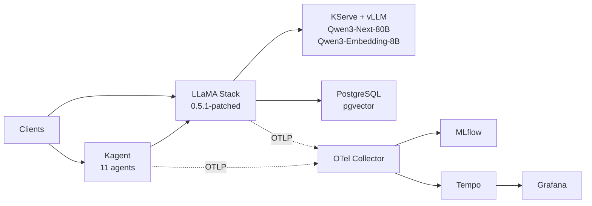

# AI Catalyst Lab

Kubernetes manifests and operational runbook for a shared AI stack: LLM inference, agent orchestration, RAG, and end-to-end observability -- all open source, no vendor APIs.

## What's Deployed

A multi-tenant GPU cluster running 15+ components across 6 namespaces:

| Layer | Components | Namespace |
|-------|-----------|-----------|
| **Agent Orchestration** | Kagent v0.7.18 -- 11 agents as CRD YAMLs, A2A protocol, OTel auto-injected | `kagent` |
| **Inference Gateway** | LLaMA Stack 0.5.1 -- OpenAI-compatible API, tool calling, RAG | `catalystlab-shared` |
| **Model Serving** | KServe + llm-d + vLLM -- Qwen3-Next-80B (FP8, TP=2) + Qwen3-Embedding-8B | `kserve-lab` |
| **Data** | PostgreSQL 17 (CNPG) + pgvector -- 3 databases (vectordb, llamastack, mlflow) | `catalystlab-shared` |
| **Observability** | OTel Collector (fan-out), MLflow, Tempo, Grafana, Kiali, Prometheus | `catalystlab-shared`, `monitoring`, `istio-system` |
| **Benchmarking** | GuideLLM -- inference benchmarks as K8s Jobs, results uploaded to MLflow | `guide-llm` |

## Key Results

- **Agent deployment**: 11/11 agents Ready from CRD manifests, zero custom code
- **Observability noise**: 108+ OTel spans/min from probe traffic filtered at the collector before any inference runs
- **Trace fan-out**: Single OTel pipeline writes to MLflow (experiment tracking + custom metadata) + Tempo (distributed storage + Grafana dashboards) simultaneously
- **RAG pipeline**: End-to-end verified -- document upload, chunking, embedding (Qwen3-Embedding-8B), pgvector storage, semantic search
- **Custom image**: Upstream regressions fixed in `quay.io/aicatalyst/llamastack-starter:0.5.1-patched` (OTel instrumentation, Agents API crash, vLLM dimensions compatibility)

## Architecture

See [`ARCHITECTURE.md`](./ARCHITECTURE.md) for the full system description and data flow.

See [`diagrams/lab-architecture.md`](./diagrams/lab-architecture.md) for the authoritative Mermaid diagram with node/edge reference tables and gap tracking.


```mermaid
graph LR
    Clients["Clients"] --> Agents["Kagent
    11 agents"]
    Clients --> Gateway["LLaMA Stack
    0.5.1-patched"]
    Agents --> Gateway
    Gateway --> Models["KServe + vLLM
    Qwen3-Next-80B
    Qwen3-Embedding-8B"]
    Gateway --> Data["PostgreSQL
    pgvector"]
    Gateway -.->|"OTLP"| OTel["OTel Collector"]
    Agents -.->|"OTLP"| OTel
    OTel --> MLflow["MLflow"]
    OTel --> Tempo["Tempo"]
    Tempo --> Grafana["Grafana"]
```

## Project Structure

```
catalyst-lab/
├── kagent/                 # Agent orchestration (Kagent v0.7.18)
│   ├── agents/             # Agent CRD definitions (labdemo-agent, benchmark-agent)
│   ├── rbac-scoped.yaml    # Scoped RBAC (read cluster, write catalystlab-shared)
│   ├── mcp-gateway-remote.yaml  # RemoteMCPServer for Envoy AI Gateway
│   ├── values.yaml         # Helm values
│   └── README.md
├── llamastack/             # LLaMA Stack inference gateway
│   ├── Containerfile       # Custom image build (OTel + hotfixes)
│   ├── llamastack.yaml     # Deployment manifest
│   └── llamastack-config.yaml  # v2 config (models, providers, resources)
├── otel-collector/         # OpenTelemetry Collector
│   ├── otel-collector.yaml # ConfigMap + Deployment + Service
│   └── README.md           # Pipeline documentation
├── envoy-ai-gateway/       # Envoy AI Gateway MCP aggregation
│   └── mcp-gateway.yaml    # EnvoyProxy + Gateway + MCPRoute
├── toolhive/               # ToolHive MCP server CRDs
│   ├── filesystem-mcp.yaml # Filesystem MCP server
│   ├── postgres-mcp.yaml   # PostgreSQL MCP server
│   └── README.md
├── mcpmark/                # MCP benchmark tool
│   ├── benchmark-job.yaml  # Kubernetes Job manifest
│   ├── Containerfile       # Custom image with dependencies
│   └── README.md
├── guidellm/               # LLM benchmarking
│   ├── benchmark-job.yaml  # Kubernetes Job manifest
│   └── README.md
├── pgvector/               # PostgreSQL + pgvector (CNPG)
│   └── cluster.yaml        # CloudNativePG cluster definition
├── mlflow/                 # MLflow experiment tracking
│   ├── deployment.yaml     # MLflow server
│   └── README.md
├── tempo/                  # Distributed tracing backend
│   ├── tempo-minimal-values.yaml  # Tempo Helm values
│   ├── ingress.yaml        # Tempo UI ingress
│   └── README.md
├── jaeger/                 # DEPRECATED (replaced by Tempo, March 2026)
│   └── README.md
├── grafana/                # Grafana dashboards
│   ├── catalyst-lab-overview.json  # Dashboard export
│   └── README.md
├── istio/                  # Service mesh configuration
│   ├── istio-values.yaml   # Istio Helm values
│   └── README.md
├── kiali/                  # Mesh topology visualization
│   ├── kiali-values.yaml   # Kiali Helm values
│   └── README.md
├── kagenti/                # Istio AuthZ policies for agent namespaces
├── kserve/                 # KServe model serving
│   └── README.md
├── open-webui/             # Chat interface
│   └── README.md
├── scripts/                # Operational scripts
│   ├── guidellm_to_mlflow.py   # Upload benchmark results to MLflow
│   ├── demo-scenario.sh        # Generate demo traffic
│   ├── run-benchmark-sweep.sh  # Concurrency sweep benchmarks
│   ├── export-grafana-dashboard.sh  # Export dashboard JSON
│   ├── check-sensitive-data.py # Pre-commit sensitive data scanner
│   └── README.md
├── diagrams/               # Architecture diagrams (Mermaid)
│   └── lab-architecture.md # Authoritative diagram + gap tracking
├── ARCHITECTURE.md         # System architecture documentation
└── AGENTS.md               # AI agent coding instructions
```

## Technology Stack

| Component | Version | Role |
|-----------|---------|------|
| Kagent | v0.7.18 | Agent orchestration (CNCF Sandbox) |
| LLaMA Stack | 0.5.1-patched | Inference gateway, RAG, tool calling |
| KServe | v0.16.0 | Model serving platform |
| llm-d | v0.4.0/v0.5.0 | Inference scheduling (EPP) |
| vLLM | latest | LLM inference engine |
| Qwen3-Next-80B-A3B-Instruct-FP8 | RedHatAI | Primary LLM (chat + tool calling) |
| Qwen3-Embedding-8B | Qwen | Embedding model for RAG |
| PostgreSQL | 17 (CNPG) | Shared database (3 DBs) |
| OTel Collector | contrib:latest | Telemetry pipeline |
| MLflow | latest | Experiment tracking + custom trace metadata |
| Tempo | 2.6.1 (distributed) | Distributed tracing backend |
| Grafana | latest | Dashboards |
| Prometheus | latest | Metrics |
| Kiali | latest | Istio mesh topology |
| GuideLLM | latest | Inference benchmarking |
| Istio | Ambient + Sidecar | Service mesh (mTLS) |

## Quick Start

### Prerequisites

- Kubernetes cluster with GPU nodes
- `kubectl` and Helm 3.x
- Access to `quay.io/aicatalyst` container registry

### Deploy Core Components

```bash
# Clone the repository
git clone https://github.com/aicatalyst-team/catalyst-lab
cd catalyst-lab

# 1. PostgreSQL (CNPG) -- shared database for all components
kubectl create namespace catalystlab-shared
kubectl apply -f pgvector/cluster.yaml

# 2. OTel Collector -- telemetry pipeline (deploy before instrumented services)
kubectl apply -f otel-collector/otel-collector.yaml

# 3. LLaMA Stack -- inference gateway
kubectl apply -f llamastack/llamastack.yaml

# 4. MLflow -- experiment tracking
kubectl apply -f mlflow/deployment.yaml -f mlflow/service.yaml

# 5. Tempo -- distributed tracing backend
helm repo add grafana https://grafana.github.io/helm-charts && helm repo update
helm install tempo grafana/tempo-distributed -n catalystlab-shared -f tempo/tempo-minimal-values.yaml

# 6. Kagent -- agent orchestration (Helm)
helm install kagent oci://cr.kagent.dev/kagent-dev/kagent/charts/kagent \
  -n kagent --create-namespace -f kagent/values.yaml
# Apply scoped RBAC (replaces chart's cluster-admin)
kubectl apply -f kagent/rbac-scoped.yaml
# Deploy custom agents
kubectl apply -f kagent/agents/

# 7. Run a benchmark (optional)
kubectl create namespace guide-llm
kubectl apply -f guidellm/benchmark-job.yaml
```

### Verify

```bash
# Check all components
kubectl get pods -n catalystlab-shared
kubectl get pods -n kagent
kubectl get pods -n kserve-lab

# Verify traces are flowing
kubectl logs -n catalystlab-shared deploy/otel-collector | tail -20

# Test an agent via A2A
kubectl exec -n kagent deploy/kagent -- \
  curl -s http://labdemo-agent:9999/a2a -d '{"method":"tasks/send","params":{"message":{"parts":[{"text":"Is the lab healthy?"}]}}}'
```

## Documentation

Each component directory contains a `README.md` with deployment instructions, caveats, and verification steps. This repo serves as the team's operational runbook.

- [Architecture Guide](./ARCHITECTURE.md) -- system design, data flow, known limitations
- [Architecture Diagram](./diagrams/lab-architecture.md) -- Mermaid diagram with gap tracking
- [OTel Collector](./otel-collector/README.md) -- pipeline configuration, filtering, transforms
- [Kagent](./kagent/README.md) -- agent deployment, RBAC scoping, Helm upgrade strategy
- [GuideLLM](./guidellm/README.md) -- benchmark execution and MLflow upload
- [Scripts](./scripts/README.md) -- operational utilities

## Development

### Setup

```bash
git clone https://github.com/aicatalyst-team/catalyst-lab
cd catalyst-lab
make setup    # installs pre-commit hooks, ruff, pylint, markdownlint
```

### Linting

```bash
make lint             # run all linters
make lint-python      # ruff + pylint only
make lint-markdown    # markdownlint only
```

### Pre-commit Checks

```bash
make pre-commit       # run all pre-commit hooks against all files
```

## Contributing

See [CONTRIBUTING.md](./CONTRIBUTING.md). Pre-commit hooks enforce security rules -- run `make setup` before your first commit.

## License

See [LICENSE](./LICENSE).
