# Catalyst Lab - High Level Overview

> Production-ready Kubernetes infrastructure for LLM inference, agentic AI, and observability

## What is Catalyst Lab?

Catalyst Lab is a comprehensive Kubernetes-based platform for deploying, operating, and monitoring Large Language Model (LLM) applications with agentic AI capabilities. It provides the complete stack needed to run production LLM workloads with enterprise-grade observability, benchmarking, and integration capabilities.

## Architecture at a Glance

```mermaid
graph LR
    Users[👥 Users] --> Frontend[🎨 WebUI]
    Frontend --> Agents[🤖 AI Agents<br/>Kagenti/BeeAI]
    Agents --> LLM[🚀 LLM Inference<br/>LLAMA-STACK + KServe<br/>llm-d + vLLM]
    LLM --> MCP[🔌 MCP Gateway<br/>GitHub/Jira/Search]
    LLM --> Storage[💾 Storage<br/>PgVector + PostgreSQL]
    LLM --> Obs[📊 Observability<br/>MLFlow + Grafana]

    style Users fill:#fff,stroke:#333,stroke-width:2px
    style Frontend fill:#fff,stroke:#333
    style Agents fill:#ffd700,stroke:#333,stroke-width:2px
    style LLM fill:#90EE90,stroke:#333,stroke-width:2px
    style MCP fill:#E6E6FA,stroke:#333
    style Storage fill:#fff,stroke:#333
    style Obs fill:#FF6B6B,stroke:#333
```



## Stack Architecture - Building Blocks

The Catalyst Lab platform is built on a complete open-source stack, from hardware to application layer:

```mermaid
graph TB
    %% Application Layer
    subgraph AppLayer["🎯 Application Layer - AI Catalyst Platform"]
        App1["GuideLLM<br/>Benchmarking"]
        App2["Open WebUI<br/>Inference UI"]
    end

    %% Inference Stack
    subgraph InfStack["🚀 Inference Stack"]
        Inf1["Envoy Gateway<br/>API Gateway"]
        Inf2["KServe<br/>Model Serving"]
        Inf3["llm-d Scheduler"]
        Inf4["vLLM + Models"]
        Inf5["vLLM Production<br/>LMCache + vLLM"]
    end

    %% Observability
    subgraph ObsStack["📊 Observability & Monitoring"]
        Obs1["Grafana"]
        Obs2["Prometheus"]
        Obs3["OpenEBS"]
        Obs4["DCGM Exporter"]
        Obs5["MIG Manager"]
        Obs6["Nvidia Operator"]
    end

    %% Kubernetes Layer
    subgraph K8sStack["☸️ Kubernetes Layer - Upstream Open Source"]
        K8s1["Kubernetes<br/>Control Plane"]
        K8s2["Kubernetes<br/>Worker Nodes"]
        K8s3["Persistent<br/>Volumes"]
        K8s4["Nvidia Container<br/>Toolkit"]
    end

    %% Infrastructure Layers (Horizontal)
    subgraph InfraLayers["Infrastructure Layers"]
        subgraph StorStack["💾 Storage Stack"]
            Stor1["Logical Volume<br/>Manager"]
            Stor2["Disk Storage ++"]
        end

        subgraph GPUStack["🎮 GPU Stack"]
            GPU1["Nvidia Driver"]
            GPU2["Nvidia GPU ++<br/>A100 x8"]
        end

        subgraph OSStack["🐧 Operating System"]
            OS1["Kernel Modules"]
            OS2["Permissions"]
            OS3["CentOS 9 Stream"]
        end
    end

    %% Hardware Layer
    subgraph HWLayer["⚙️ Hardware Layer"]
        HW1["CPU ++"]
        HW2["RAM ++"]
        HW3["Disk ++"]
        HW4["Nvidia GPU ++"]
    end

    %% Connections - Vertical flow
    AppLayer --> InfStack
    InfStack --> ObsStack
    ObsStack --> K8sStack
    K8sStack --> InfraLayers
    InfraLayers --> HWLayer

    %% Styling
    classDef appStyle fill:#4A90E2,stroke:#2E5C8A,stroke-width:3px,color:#fff
    classDef infStyle fill:#FFE066,stroke:#CC9900,stroke-width:3px,color:#000
    classDef obsStyle fill:#90EE90,stroke:#2D7A2D,stroke-width:2px,color:#000
    classDef k8sStyle fill:#326CE5,stroke:#1A4D91,stroke-width:3px,color:#fff
    classDef storStyle fill:#E8E8E8,stroke:#666,stroke-width:2px,color:#000
    classDef gpuStyle fill:#76B900,stroke:#4A7300,stroke-width:3px,color:#fff
    classDef osStyle fill:#F0F0F0,stroke:#999,stroke-width:2px,color:#000
    classDef hwStyle fill:#D3D3D3,stroke:#888,stroke-width:2px,color:#000

    class App1,App2 appStyle
    class Inf1,Inf2,Inf3,Inf4,Inf5 infStyle
    class Obs1,Obs2,Obs3,Obs4,Obs5,Obs6 obsStyle
    class K8s1,K8s2,K8s3,K8s4 k8sStyle
    class Stor1,Stor2 storStyle
    class GPU1,GPU2 gpuStyle
    class OS1,OS2,OS3 osStyle
    class HW1,HW2,HW3,HW4 hwStyle
```



### Layer Descriptions

#### 🎯 Application Layer
- **GuideLLM**: Performance benchmarking tool for LLM inference endpoints
- **Open WebUI**: User-friendly web interface for LLM interactions

#### 🚀 Inference Stack
- **Envoy Gateway**: API gateway for routing and load balancing
- **KServe**: Kubernetes-native model serving platform
- **llm-d**: Custom scheduler for optimized LLM workload distribution
- **vLLM**: High-performance inference engine with model serving
- **vLLM Production**: Production deployment with LMCache for improved performance

#### 📊 Observability & Monitoring
- **Grafana**: Visualization and monitoring dashboards
- **Prometheus**: Metrics collection and alerting
- **OpenEBS**: Container-attached storage for Kubernetes
- **DCGM Exporter**: Nvidia GPU metrics exporter
- **MIG Manager**: Multi-Instance GPU management
- **Nvidia Operator**: GPU operator for Kubernetes

#### ☸️ Kubernetes Layer
- **Control Plane**: Kubernetes cluster management
- **Worker Nodes**: Compute nodes for workload execution
- **Persistent Volumes**: Storage abstraction layer
- **Nvidia Container Toolkit**: GPU container runtime integration

#### 💾 Storage Stack
- **Logical Volume Manager**: Flexible disk management
- **Disk Storage**: High-capacity storage infrastructure

#### 🎮 GPU Stack
- **Nvidia Driver**: GPU driver for compute acceleration
- **GPU Hardware**: Nvidia A100 GPUs (8x) for inference

#### 🐧 Operating System
- **Kernel Modules**: System extensions and drivers
- **Permissions**: Security and access control
- **CentOS 9 Stream**: Base operating system

#### ⚙️ Hardware Layer
- **CPU**: Multi-core processors for compute
- **RAM**: High-capacity memory
- **Disk**: NVMe/SSD storage devices
- **GPU**: Nvidia A100 accelerators

## Core Capabilities

### 🤖 Agentic AI
- **Kagenti**: Kubernetes-native agent orchestration
- **BeeAI**: Production-ready AI agents with A2A communication
- **Agentic Benchmarks**: TravelPlanner, VendingBench evaluation suites

### 🚀 LLM Inference
- **LLAMA-STACK**: Unified LLM inference orchestration
- **KServe**: Kubernetes-native model serving
- **vLLM**: High-performance inference engine with GPU optimization
- **llm-d scheduler**: Intelligent workload scheduling

### 🔌 Integrations (MCP Servers)
- **GitHub**: Source code and repository management
- **Jira**: Project tracking and issue management
- **Brave Search**: Web search capabilities
- **Kuadrant Gateway**: Centralized MCP routing and management

### 💾 Data & Storage
- **PostgreSQL**: Primary data store for applications and traces
- **PgVector**: Vector embeddings for semantic search and RAG
- **Persistent Storage**: Benchmark results and model artifacts

### 📊 Observability & Monitoring
- **MLFlow**: LLM trace collection and experiment tracking
- **OpenTelemetry + Prometheus**: Metrics collection and monitoring
- **Grafana**: Real-time dashboards and alerting
- **GuideLLM**: Performance benchmarking and load testing

## Technology Stack

| Layer | Technologies |
|-------|-------------|
| **Orchestration** | Kubernetes, Kagenti, BeeAI |
| **LLM Inference** | LLAMA-STACK, KServe, vLLM |
| **Data Storage** | PostgreSQL 17, PgVector, CloudNativePG |
| **Observability** | MLFlow, OpenTelemetry, Prometheus, Grafana |
| **Benchmarking** | GuideLLM, TravelPlanner, VendingBench |
| **Integration** | MCP (Model Context Protocol), Kuadrant |
| **Languages** | Python, Go, TypeScript |

## Quick Start

### Prerequisites
- Kubernetes cluster (1.24+) with GPU nodes
- kubectl and Helm 3.x installed
- 8GB+ RAM, 4+ CPU cores, 50GB+ storage available

### Deploy the Stack

```bash
# 1. Clone the repository
git clone https://github.com/aicatalyst-team/catalyst-lab
cd catalyst-lab

# 2. Deploy vector database
helm repo add cnpg https://cloudnative-pg.github.io/charts
helm install cnpg cnpg/cloudnative-pg --namespace cnpg-system --create-namespace
kubectl create namespace catalystlab-shared
kubectl apply -f pgvector/cluster.yaml

# 3. Run benchmarks (optional)
kubectl create namespace guide-llm
kubectl apply -f guidellm/namespace.yaml
kubectl apply -f guidellm/pvc.yaml
# Update benchmark-job.yaml with your endpoint, then:
kubectl apply -f guidellm/benchmark-job.yaml
```

### Verify Deployment

```bash
# Check PgVector cluster
kubectl get cluster -n catalystlab-shared

# Monitor benchmark job
kubectl logs -f job/guidellm-benchmark -n guide-llm
```

## Key Features

### 🎯 Production-Ready
- High-availability PostgreSQL with CloudNativePG operator
- GPU-optimized LLM inference with vLLM
- Auto-scaling inference workloads with KServe
- Enterprise observability with MLFlow and Grafana

### 🔐 Security & Compliance
- Kubernetes RBAC and network policies
- Secure secret management
- TLS/HTTPS for external endpoints
- Audit logging and trace collection

### 📈 Performance & Scalability
- Horizontal scaling for inference workloads
- GPU resource pooling and efficient batching
- Optimized vector similarity search with HNSW indexes
- Distributed agent orchestration

### 🧪 Testing & Benchmarking
- Automated performance testing with GuideLLM
- Agentic AI evaluation benchmarks
- Load testing with realistic traffic patterns
- Comprehensive metrics (TTFT, ITL, throughput)

## Use Cases

| Use Case | Description |
|----------|-------------|
| **RAG Applications** | Build retrieval-augmented generation systems with PgVector |
| **Agentic AI** | Deploy autonomous agents with tool use and planning |
| **LLM Operations** | Production LLM serving with observability and monitoring |
| **Research & Experimentation** | Benchmark and evaluate LLM performance |
| **Enterprise Integration** | Connect LLMs to GitHub, Jira, and search APIs |

## Project Structure

```
catalyst-lab/
├── guidellm/              # LLM benchmarking (GuideLLM)
│   ├── benchmark-job.yaml # Kubernetes Job for benchmarks
│   ├── namespace.yaml     # Namespace configuration
│   └── pvc.yaml          # Storage for results
├── pgvector/             # Vector database (PostgreSQL + pgvector)
│   └── cluster.yaml      # CloudNativePG cluster
├── ARCHITECTURE.md       # Detailed architecture documentation
├── architecture.mmd      # Mermaid diagram source
└── README.md            # This file (high-level overview)
```

## Related Projects

### [Langfuse](https://github.com/aicatalyst-team/langfuse)
LLM observability platform with prompt management, evaluation metrics, and trace analysis.

### [KServe](https://github.com/aicatalyst-team/kserve)
Kubernetes-native model serving for scalable ML inference across multiple frameworks.

## Documentation

- 🏗️ [Architecture Guide](./ARCHITECTURE.md) - Detailed system architecture with Mermaid diagrams
- 🔧 [GuideLLM Benchmarking](./guidellm/README.md) - Performance testing guide
- 💾 [PgVector Setup](./pgvector/README.md) - Vector database deployment

## Roadmap

- [ ] **Enhanced Observability**: Visual MLFlow integration, advanced dashboards
- [ ] **Additional MCP Servers**: Slack, Confluence, custom integrations
- [ ] **Helm Charts**: Simplified deployment with Helm
- [ ] **Multi-Cluster**: Federation for global LLM deployment
- [ ] **Security Hardening**: mTLS, policy enforcement, advanced RBAC
- [ ] **CI/CD Templates**: Automated testing and deployment pipelines

## Community & Support

- 🐛 **Issues**: [GitHub Issues](https://github.com/aicatalyst-team/catalyst-lab/issues)
- 💬 **Discussions**: [GitHub Discussions](https://github.com/aicatalyst-team/catalyst-lab/discussions)
- 📝 **Contributing**: Fork, create a feature branch, test changes, and submit a PR
- 📚 **Resources**: Check component-specific READMEs for detailed guides

## License

See [LICENSE](./LICENSE) for details.

---

**🚀 Built for production LLM deployments on Kubernetes**

[Architecture](./ARCHITECTURE.md) | [View on GitHub](https://github.com/aicatalyst-team/catalyst-lab)
